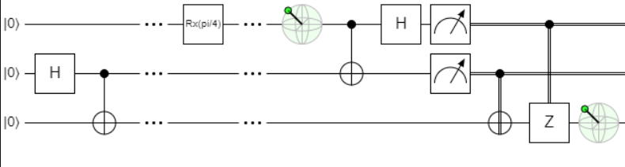

# Определения
## Кубит
Кубит — квантовый бит — это фундаментальная единица квантовой информации.
В любой конкретный момент времени он находится в состоянии суперпозиции, представленном линейной комбинацией:

$$|\psi\rangle = \alpha|0\rangle + \beta|1\rangle$$
$$\alpha^2 + \beta^2 = 1$$
где $\alpha$ и $\beta$ амплитуды вероятности измерить состояние кубита $|0\rangle$ или $|1\rangle$.

В том числе можно представить как:
$$|\psi\rangle = r_1|0\rangle + r_2*e^{\phi i}|1\rangle$$
$$r_1^2 + r_2^2 = 1$$
$$r_1 = \cos(\frac{\theta}{2}); r_2=\sin(\frac{\theta}{2}) $$
$$|\psi\rangle = \cos(\frac{\theta}{2})|0\rangle + \sin(\frac{\theta}{2})e^{\phi i}|1\rangle $$

# Гейты
## Гейт Адамара
### Описание
Гейт Адамара представляет собой матрицу:
$$H_1 = \frac{1}{\sqrt{2}}\begin{bmatrix} 1 & 1 \\ 1 & -1 \end{bmatrix} $$
Матрица Адамара расширяется для N-кубитов следующим образом:
$$
H^{\otimes n}
$$
где $\otimes n$ означает тензорное произведение (произведение кронекера) $n$ раз.

### Примеры использования
$$ H \times |0\rangle = |+\rangle $$
$$ H \times |1\rangle = |-\rangle $$
$$ H \times |+\rangle = |0\rangle $$
$$ H \times |-\rangle = |1\rangle $$

###  Пример гейта

## Гейт X
### Описание
В классических дискретных вычислениях оператор NOT – это оператор инверсии. В соответствии с этим
определением классического оператора NOT, квантовый гейт X может быть определен по аналогии:
$|\psi\rangle = \alpha|0\rangle + \beta|1\rangle \rightarrow X|\psi\rangle = \alpha|1\rangle + \beta|0\rangle$

Гейт X представлен следующей матрицей:
$$X = \begin{bmatrix} 1 & 0 \\ 0 & 1 \end{bmatrix} $$

### Примеры использования
$$ X \times |0\rangle = |1\rangle $$
$$ X \times |1\rangle = |0\rangle $$

## Гейт Rx 
### Описание
Гейт поворота на угол $\theta$ вокруг оси $x$:
$$ Rx(\theta) = e^{-i\frac{\theta}{2}X} = \begin{bmatrix} \cos(\frac{\theta}{2}) & -i*\sin(\frac{\theta}{2}) \\ -i*\sin(\frac{\theta}{2}) & \cos(\frac{\theta}{2})  \end{bmatrix}$$ 

## Гейт Ry 
Гейт поворота на угол $\theta$ вокруг оси $y$:
$$ Ry(\theta) = e^{-i\frac{\theta}{2}Y} = \begin{bmatrix} \cos(\frac{\theta}{2}) & -\sin(\frac{\theta}{2}) \\ \sin(\frac{\theta}{2}) & \cos(\frac{\theta}{2})  \end{bmatrix}$$ 

## Гейт Rz
Гейт поворота на угол $\theta$ вокруг оси $z$:
$$ Rz(\theta) = e^{-i\frac{\theta}{2}Z} = \begin{bmatrix} e^{-i\frac{\theta}{2}} & 0 \\ 0 & e^{-i\frac{\theta}{2}}  \end{bmatrix}$$ 

# Алгоритмы
## Quantum Random Generator
Quantum Random Generator - алгоритм получения случайного бита с помощью кубита.

QRNG - выставляет кубит $|0\rangle$ в состояние $|+\rangle$ и при измерении
можно равновероятно получить как логически 0 так и логически 1.

### Вероятность измерить состояние
Распределение вероятностей при использовании гейта Адамара будет слеудющим:

| State | P   |
|--|-----|
| 0| 0.5 |
| 1 | 0.5|

Если применить другой поворот, например Rx(pi/4) получим следующее распределение вероятностей (примерно):

| State | P    |
|--|------|
| 0| 0.85 |
| 1 | 0.15 |

Следующая схема:

Сфера блоха для q0:

## Quantum key distribution <TBD>

### BB84 Explanation <TBD>

## Deutsch algorithm
Задача Дойча формулируется следующим образом:
$$ f: \{0, 1\} \rightarrow \{0, 1\}$$
Функция $f$ может быть сбалансированной или постоянной.
Алгоритм Дойча нацелен, чтобы получить ответ на поставленный вопрос:
является ли функция сбалансированной или постоянной.

Квантовый алгоритм Дойча использует оракул для получения ответов:

$$U_f |x\rangle|y\rangle = |x\rangle|y \oplus f(x)\rangle$$

Ниже представлена схема квантового алгоритма:

На выходе мы измеряем 1 кубит и можем получить значение 0 или 1, которое означает что входная функция является 
постоянной или сбалансированной. 

## Deutsch-Jozsa algorithm <TBD>
Задача Дойча формулируется следующим образом:
$$ f: \{0, 1\}^n \rightarrow \{0, 1\}$$
Пусть функция $f$ может быть сбалансированной или постоянной.
Алгоритм Дойча-Йожи нацелен, чтобы получить ответ на поставленный вопрос:
является ли функция сбалансированной или постоянной.

Квантовый алгоритм Дойча-Йожи использует оракул для получения ответов:

$$U_f |x\rangle|y\rangle = |x\rangle|y \oplus f(x)\rangle$$

Ниже представлена схема квантового алгоритма:

В алгоритме учавствуют N+1 кубит.

На выходе мы измеряем N кубит и вектор значений, которые подскажут является ли функция
сбалансированной или нет.

## Bernstein-Vazirani algorithm <TBD>
Задача Бернштейна-Вазирани формулируется следующим образом:
$$ f: \{0, 1\}^n \rightarrow \{0, 1\}$$
$$ f(x) = s \oplus x $$ 
Пусть функция $f$ может быть сбалансированной или постоянной.
Алгоритм Дойча-Йожи нацелен, чтобы получить ответ на поставленный вопрос:
является ли функция сбалансированной или постоянной.

Квантовый алгоритм Дойча-Йожи использует оракул для получения ответов:

$$U_f |x\rangle|y\rangle = |x\rangle|y \oplus f(x)\rangle$$

Ниже представлена схема квантового алгоритма:

В алгоритме учавствуют N+1 кубит.

На выходе мы измеряем N кубит и вектор значений, которые представляют загаданное число s.

## Simon problem <TBD>
Задача Саймона формулируется следующим образом:
$$f: \{0, 1\}^n \rightarrow \{0, 1\}^n$$
$$\exists s \neq 0: \forall x  f(x) = f(y) \Leftrightarrow y = x \oplus s $$

Мы ищем s - период когда значение булевой функции повторяется.

Схема алгоритма представлена ниже:

При измерении мы получаем вектор значений $y$ для решения СЛУ:

$$
\begin{aligned}
s_0 * y_0 \oplus \dots \oplus s_i*y_i \oplus \dots \oplus s_{n}*y_{n} = 0 \dots
\end{aligned}
$$
При составлении СЛУ игнорируется вектор $y={0}$;

Вероятность успеха алгоритма Саймона выражается следующим образом:
$$
P_{Simon}(success) > \prod_{k=1}^{K}(1-\frac{1}{2^k}) > \frac{1}{4} \space | \space K \rightarrow \infty
$$

## Quantum teleport
Алгоритм квантовой телепортации решает фундаментальную проблему связанную с запертом на точное копирование 
состояине кубитов.

Ниже представлена схема телепортации:

